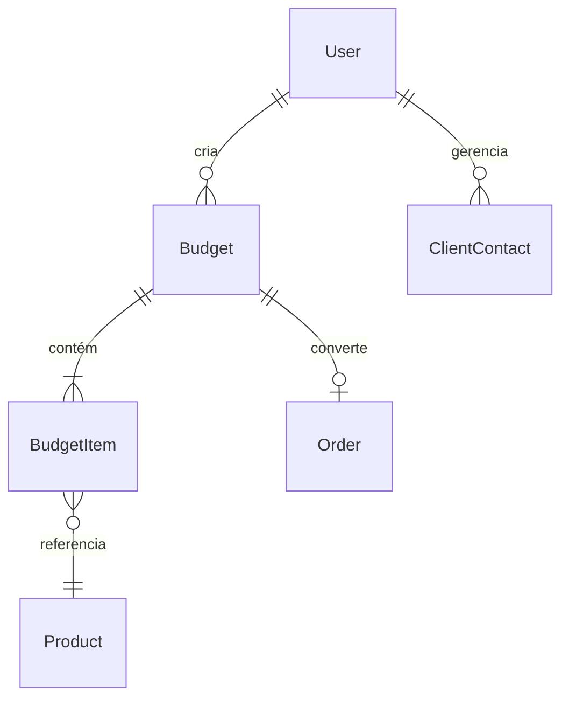

# Documentação do Banco de Dados 🗄️

O Portal dos Eletricistas utiliza **PostgreSQL** como banco de dados principal, gerenciado através do **Prisma ORM**.

## 🏗 Estrutura Principal

### Usuários (`User`)
- Representa Eletricistas, Admins e Clientes.
- **Relacionamentos:** Possui orçamentos (`Budget`), contatos (`ClientContact`) e subcrições de push.
- **Campos Especiais:** Possui campos para gamificação (`view_count`) e integração futura com Sankhya (`sankhya_partner_id`).

### Orçamentos (`Budget`)
- Documento central da aplicação.
- **Status:** `DRAFT`, `SHARED`, `APPROVED`, etc.
- **Relacionamentos:** Contém múltiplos `BudgetItem`. Pode ser convertido em uma `Order`.

### Produtos (`Product`)
- Catálogo sincronizado com Sankhya.
- **Busca:** Utiliza índices de popularidade e status de busca de imagem.

## 🔄 Fluxo de Migração

Para realizar alterações no banco:
1. Altere o arquivo `apps/api/prisma/schema.prisma`.
2. Gere a migração local: `npx prisma migrate dev --name descrição_da_mudança`.
3. Aplique em produção: Automático via script de deploy (`npx prisma migrate deploy`).

## 📊 Diagrama de Relacionamentos (Simplificado)

---
*Para ver o esquema completo, consulte [schema.prisma](../apps/api/prisma/schema.prisma)*
