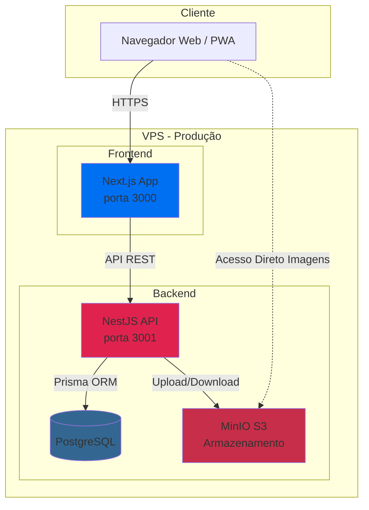
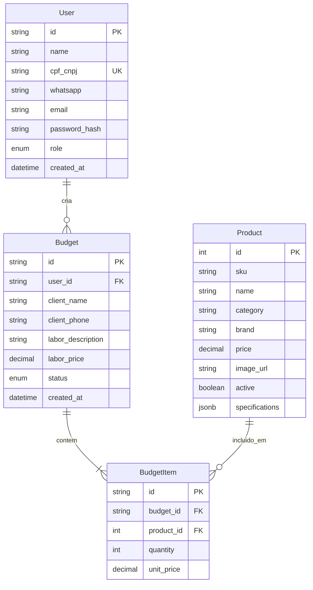
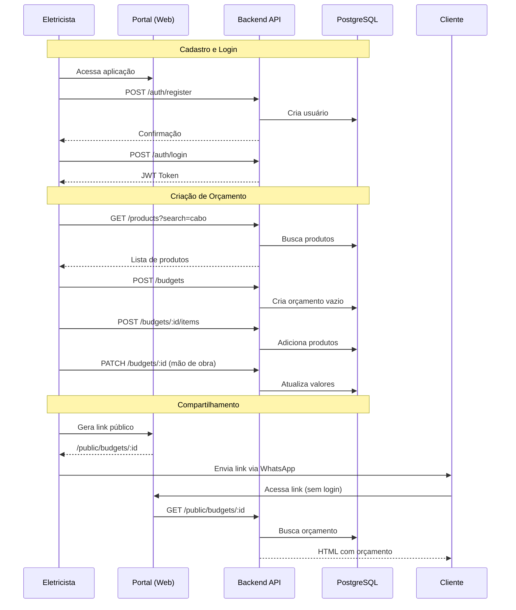

# Arquitetura Atual - Portal dos Eletricistas

**Versão:** v1.1.0  
**Última Atualização:** 31 de Dezembro de 2025

---

## 📐 Visão Geral

O Portal dos Eletricistas é uma aplicação web full-stack que permite aos eletricistas criar orçamentos profissionais para seus clientes, com catálogo de produtos elétricos sincronizados.

### Stack Tecnológico

**Frontend:**
- **Framework:** Next.js 14 (App Router)
- **UI:** React 18 + TypeScript
- **Estilos:** TailwindCSS
- **PWA:** next-pwa (Progressive Web App)
- **Deploy:** VPS com Docker

**Backend:**
- **Framework:** NestJS
- **Linguagem:** TypeScript
- **ORM:** Prisma
- **Banco de Dados:** PostgreSQL
- **Armazenamento:** MinIO S3 (imagens)
- **Deploy:** VPS com Docker

---

## 🏗 Arquitetura de Componentes



---

## 🧩 Estrutura do Projeto (Monorepo)

```
Portal dos Eletricistas/
├── apps/
│   ├── web/                 # Frontend Next.js
│   │   ├── app/             # App Router (páginas)
│   │   ├── components/      # Componentes React
│   │   └── public/          # Assets estáticos
│   │
│   └── api/                 # Backend NestJS
│       ├── src/
│       │   ├── auth/        # Autenticação JWT
│       │   ├── users/       # Gestão de usuários
│       │   ├── products/    # Catálogo de produtos
│       │   ├── budgets/     # Sistema de orçamentos
│       │   └── admin/       # Rotas administrativas
│       └── prisma/          # Schema do banco
│
├── docs/                    # Documentação do projeto
├── scripts/                 # Scripts utilitários
└── docker-compose.prod.yml  # Deploy em produção
```

---

## 🔐 Modelo de Dados



---

## 🚀 Funcionalidades Implementadas (v1.1.0)

### ✅ Autenticação
- Registro de eletricistas (CPF/CNPJ + WhatsApp)
- Login com JWT
- Recuperação de senha
- Perfil de usuário editável
- Checkbox de aceite de termos (LGPD)

### ✅ Catálogo de Produtos
- Listagem com busca inteligente
- Sinônimos (cabo=fio, disjuntor=breaker)
- Normalização de medidas (2.5mm = 2,5)
- Paginação
- Imagens armazenadas no MinIO S3
- Feedback de busca ("Não encontrei")

### ✅ Sistema de Orçamentos
- Criação de orçamentos
- Adição de produtos ao orçamento
- Input editável de quantidade
- Campo de descrição de mão de obra
- Preço customizável de mão de obra
- Visualização pública via link compartilhável
- Geração de PDF
- Micro-dashboard (totais, ticket médio)

### ✅ Painel Administrativo
- Sincronização de produtos (API externa)
- Gestão de usuários
- Acesso restrito (role-based)

### ✅ PWA
- Instalável no dispositivo
- Ícones e manifesto configurados
- Cache offline básico

---

## 🔌 Principais Endpoints da API

### Autenticação
```
POST   /auth/register          # Cadastro de novo usuário
POST   /auth/login             # Login com CPF/email + senha
POST   /auth/forgot-password   # Solicitar reset de senha
POST   /auth/reset-password    # Resetar senha
GET    /auth/me                # Obter usuário autenticado
```

### Produtos
```
GET    /products               # Listar produtos (com busca)
GET    /products/:id           # Detalhes do produto
```

### Orçamentos
```
POST   /budgets                # Criar orçamento
GET    /budgets                # Listar orçamentos do usuário
GET    /budgets/:id            # Detalhes de orçamento
PATCH  /budgets/:id            # Atualizar orçamento
DELETE /budgets/:id            # Deletar orçamento
GET    /budgets/:id/pdf        # Gerar PDF do orçamento
GET    /public/budgets/:id     # Visualização pública (sem auth)
```

### Usuários
```
GET    /users/profile          # Obter perfil
PATCH  /users/profile          # Atualizar perfil
```

### Admin
```
POST   /admin/sync/products    # Sincronizar produtos
GET    /admin/users            # Listar todos os usuários
```

---

## 🌊 Fluxo de Usuário Principal



---

## 🔧 Integrações Externas

### MinIO S3
- **Endpoint:** `https://s3.gera-leads.com`
- **Bucket:** `portal-produtos`
- **Uso:** Armazenamento de imagens de produtos
- **Acesso:** Público (readonly)

### API Externa de Produtos (Futura)
- Sincronização de catálogo (atualmente manual via admin)
- Preços e disponibilidade
- Imagens de produtos

---

## 📝 Notas Sobre Deploy

O projeto utiliza **Docker Compose** para deploy em VPS:

- **Frontend:** Container `web` (porta 3000)
- **Backend:** Container `api` (porta 3001)
- **Banco:** PostgreSQL container
- **Reverse Proxy:** Caddy (HTTPS automático)

**Domínios:**
- Frontend: `https://app.portaleletricos.com.br`
- API: `https://api.portaleletricos.com.br`

---

## 🎯 Próximos Passos (Roadmap Q1 2026)

Ver documento [ROADMAP.md](./ROADMAP.md) para o plano completo.

**Destaques:**
- Banco de especificações técnicas dos produtos
- Templates de orçamento pré-configurados
- Calculadora de cabos/disjuntores
- CRM básico (status de orçamentos)
- Melhorias no PDF

---

## 📚 Documentos Relacionados

- [ROADMAP.md](./ROADMAP.md) - Planejamento estratégico
- [DIRECTIVES.md](./DIRECTIVES.md) - Padrões de código e Git
- [guia_dev.md](./guia_dev.md) - Onboarding de desenvolvedores
- [CHANGELOG.md](../CHANGELOG.md) - Histórico de versões
- [docs/setup/minio.md](./setup/minio.md) - Configuração MinIO
