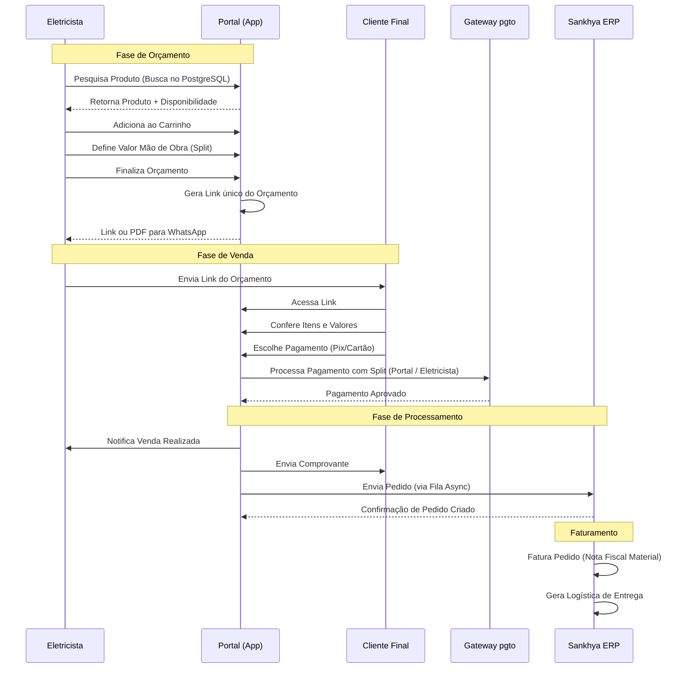
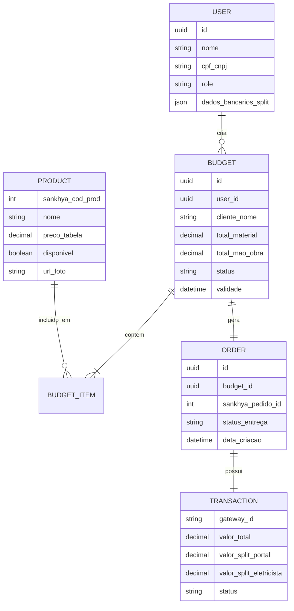

# Diagramas Visuais - Portal do Eletricista

## 1. Diagrama de Arquitetura de Solução

Este diagrama detalha a infraestrutura, camadas de aplicação e a estratégia de integração segura com o ERP Sankhya.

```mermaid
graph TB
    subgraph "Cliente Final & Eletricista"
        App[Web App / PWA]
        Mobile[Mobile Browser]
    end

    subgraph "Camada de Borda (Edge)"
        CDN[CDN / WAF]
        Auth[Identity Provider (Auth0/Cognito)]
    end

    subgraph "Cloud (Portal do Eletricista)"
        API[API Gateway / Backend NestJS]
        Cache[Redis Cache]
        DB[(PostgreSQL - Réplica Produtos + Dados Portal)]
        Queue[Fila de Pedidos (SQS/RabbitMQ)]
        Worker[Worker Service]
    end

    subgraph "Serviços Externos"
        Gateway[Gateway Pagamento (Pagar.me/Asaas)]
        WhatsApp[API WhatsApp]
    end

    subgraph "Ambiente Seguro (On-Premise/Cloud Privada)"
        Connector[Sync Service / Connector]
        Sankhya[ERP Sankhya]
        Firewall[Firewall Corporativo]
    end

    %% Fluxos
    App -->|HTTPS/TLS| CDN
    CDN -->|Request| API
    App -.->|Login| Auth
    API -.->|Token Validação| Auth

    API -->|Leitura Rápida| Cache
    API -->|Persistência| DB
    API -->|Split Payment| Gateway
    API -->|Notificação| WhatsApp

    %% Integração Sankhya
    API -->|Grava Pedido| Queue
    Worker -->|Lê Pedido| Queue
    Worker -->|Insere Pedido| Connector
    Connector -->|Sync Produtos| DB
    Connector <-->|API/JDBC| Sankhya
    
    %% Segurança
    Firewall -->|Allow Whitelist| Connector
```

## 2. Diagrama de Fluxo do Usuário (Jornada de Venda)

Este fluxo ilustra a jornada do Eletricista desde a criação do orçamento até o recebimento da comissão.



## 3. Modelo de Dados (Entidade-Relacionamento Simplificado)


